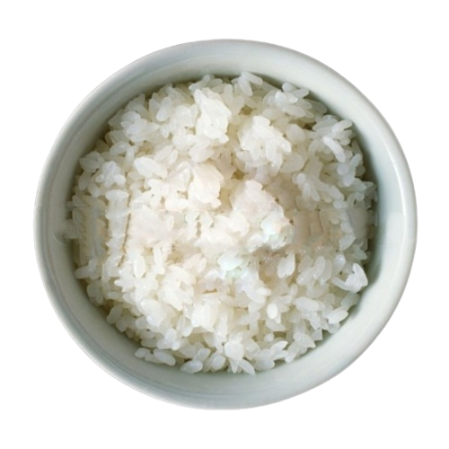

# cookieclicker

The original game can be found at http://orteil.dashnet.org/cookieclicker/

This mirror for, errrr, like, educational purpose, either to download for your own offline education or to be played online from http://ozh.github.io/cookieclicker/ if you cannot "educate" yourself on the original URL

### How to update

If the original game updates, here is how you can update the mirror:

#### 1. Fetch all new images :

From the root,

* `cd img/`
* `wget --convert-links -O index.html http://orteil.dashnet.org/cookieclicker/img/`
* `grep -v PARENTDIR index.html | grep -o '<a href=".*">' | sed 's/<a href="//' | sed 's/">//' > list.txt`
* `wget -N -i list.txt -B http://orteil.dashnet.org/cookieclicker/img/`

#### 2. Fetch all new sounds :

Similarly :

* `cd snd/`
* `wget --convert-links -O index.html http://orteil.dashnet.org/cookieclicker/snd/`
* `grep -v PARENTDIR index.html | grep -o '<a href=".*">' | sed 's/<a href="//' | sed 's/">//' > list.txt`
* `wget -N -i list.txt -B http://orteil.dashnet.org/cookieclicker/snd/`

#### 3. Update `js` and `html` files :

From the root directory :

* Fetch the updated `index.html` file: `wget -O index.html http://orteil.dashnet.org/cookieclicker/` 
* Fetch the updated `style.css` file: `wget -O style.css http://orteil.dashnet.org/cookieclicker/style.css`
* Fetch updated `js` files : `wget -N -i list.txt -B http://orteil.dashnet.org/cookieclicker/`
* Scan `index.html` for any new `<script src` and also `main.js` for any new local javascript (eg `Game.last.minigameUrl`)
* In `main.js` there is a call to a remote script we need to modify:
  * Look for `ajax('/patreon/grab.php'` and replace it with `ajax('grab.txt'`
  * In the root: `wget -O grab.txt http://orteil.dashnet.org/patreon/grab.php`

#### 4. Report update here :)

If you happen to update, please make a pull request for others to benefit, thanks!
